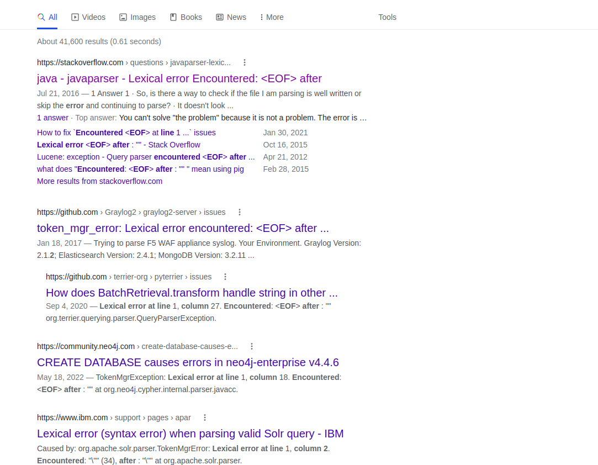
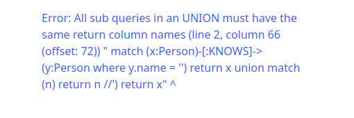
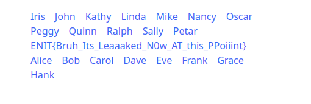

## Introduction


Another website, this time we have no code to start with. And the name tells a different story..

## Analysis

The website shows a list of persons, each is his own link. an image with a caption that says **"WHO IS HIDING A SECRET"**, and when above the persons list there's this message **"Click on the person to know who he knows"**. Once you click on a person, you get a list of persons that he knows, and the same message. The task name is **"Baby4J"**, assuming that is a reference to `Log4J` vulnerability, but based on the url `https://baby4j.deno.dev/` It is written in `Deno`. So If it is truly a reference to `Log4J`, then probably the website uses a tool or a service that has it. Yet we can't conclude. Our only input resemples in the query parameter `q` once you click on a person, where it takes us to the same page with a different list. Nothing else to notice, neither cookies nor headers.
Since this is our only place we can try to send various payloads trying to cause something to happen.

Luckily, querying `?q='` returns an error message:

```
Error: Lexical error at line 2, column 7. Encountered: <EOF> after : ""
``` 

Doing a quick Google Search, you can find the following result:


Which shows references to Java, Graylog (*which is vulnerable to Log4J*) and something interesting which is an error in `Neo4J` which is a graph database. So we can add an hypothesis that the website uses `Neo4J` as a database. What is interesting that the data pattern looks like a graph since each person knows other persons, just like a graph.

Throwing another payload like `?q=' union` to test if we can get an sql injection, we get the following error:

```
Error: Invalid input 'union': expected "!=" "%" ")" "*" "+" "-" "." "/" ":" "<" "<=" "<>" "=" "=~" ">" ">=" "AND" "CONTAINS" "ENDS" "IN" "IS" "OR" "STARTS" "XOR" "[" "^" (line 2, column 56 (offset: 62)) " match (x:Person)-[:KNOWS]->(y:Person where y.name = '' union') return x" ^
``` 
Which shows a piece of query alongside our payload, but doesn't look like a typical sql code. Using ChatGPT asking for a hint to which language this look like, I got the following response:

```
This is a query written in Cypher, a query language used in the graph database Neo4j.
```

With that, we can confirm that the website uses `Neo4J` as a database. and that the title `Baby4J` is maybe just a reference to this database and not the actual `Log4J` vulnerability. Plus we get to have a look at the query used to get the list of persons. which looks like:

```cypher
match (x:Person)-[:KNOWS]->(y:Person where y.name = 'OUR_QUERY') return x
```

Doing our researches, (for example check this [**video**](https://www.youtube.com/watch?v=T6L9EoBy8Zk)), we learn that Neo4J uses a query language called `Cypher`, and that the current query is getting every node of type `Person` that has a relationship of type `KNOWS` with another node of type `Person` where the name of the second node is equal to our query. And since our composed payloads where simply executed, that means that our input is not being sanitized. So our goal now is to get a list of all the nodes, trying to find a flag somewhere.

## Exploitation

Going through the `Cypher` documetation, and trying to match basic techniques used in sql injections, we can clearly see that there's a `union` keyword. So we need to find a way to perform a union-like Cypher query injection. 

Using `//` as a comment. And the fact that the query should end with a `return x` before using `union` (which you can find out about all of it by doing your own research about the database and the query language), using our first googled paylod to get all the nodes, we get the following result:

```?q=') return x union match (n) return n //```



renaming the variable to x, we get the following result:
```?q=') return x union match (x) return x //```



## Conclusion

This was an introductory challenge about Neo4J Graph Database, and its query language `Cypher`. I think it is a good thing to try different databases and learn about them. And not only SQL databases are vulnerable to injections, but also any kind.

## Flag
> `ENIT{Bruh_Its_Leaaaked_N0w_AT_this_PPoiiint}`


