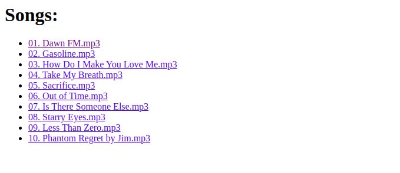
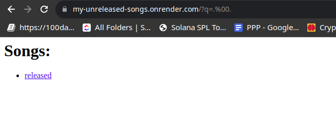
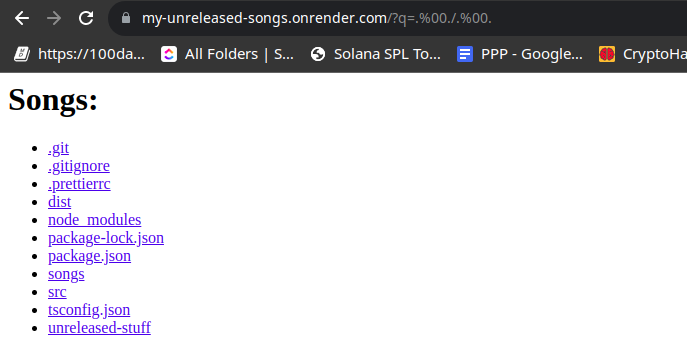
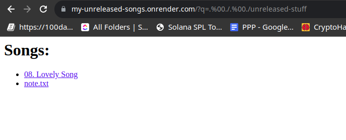

## Introduction



The website shows a list of songs, from **The Weeknd** Latest Album, **DawnFM**. and songs are basically a link with url `q=song-name.mp4`. and once you click on a song, it will download the song. and the source code is available as well.
What we are asked to do is to find a hidden song or an `unreleased` song. and then answer the questions. In addition to finding some note.

## Analysis

The source code is a small backend in Express:

```ts
import fs from 'fs'
import express, { ErrorRequestHandler } from 'express'
import cors from 'cors'
import { json } from 'body-parser'
import path from 'path'

// create an express app
const app = express()

// cors and json middleware, don't worry about them
app.use(json())
app.use(cors())

// this is the endpoint that returns our webpage
app.get('/', async (rq, rs) => {

  // retrieve the query with the name q, or an empty string if it doesn't exist
  const q = (rq.query.q || '').toString()

  // the base path
  const base = path
    // append the query to the current path plus the folder `songs/released`
    .join(__dirname, '../songs/released/', q) 
    // remove the `..` from the path, so we can't go to the parent directory
    .replaceAll('..', '')
    // splite the path into an array of characters
    .split('')
    // filter out the characters and only keep the ones that their ASCII code is greater than 0
    .filter(c => c.charCodeAt(0) > 0)
    // join the characters again
    .join('')

  try {
    // if the query exists, read the file and send it
    if (rq.query.q) {
      const song = await fs.readFileSync(base)
      return rs.send(song)
    }

    // **important**: if an error occurs, it will just continue to next instructions
  } catch {}

  // if the query doesn't exist, send the list of songs, using the base path
  try {
    const list = fs.readdirSync(base)
    const response = `
        <h1> Songs:  </h1>
        <ul>
            ${list
              .map(
                song => `
                <li> 
                    <a href="/songs/?q=${song}" >${song}</a>
                </li>`
              )
              .join('')}
            </ul>
            `
    return rs.send(response)
  } catch {}

    // if an error occurs, just send "idk" 
  return rs.send('idk')
})

// run the app on port 3000
app.listen(3000, () => {
  console.log('Server started on port 3000')
})

```

So basically we have to check what's around the files and folders, and the most important thing is the `base` variable can be set by a path that we want. 
And the second catch here is that since any error could trigger the first `try` block, we will continue to the part where we readt the folder content using our custom base path. 
The Thing is we can simply trigger an error by reading a folder as a file which pretty simple and straightforward.
Yet we have to bypass the part where the code removes the `..` from the path, so we can go to the parent directory.

and another thing to put an eye on is the `filter` part, where it filters out the characters and only keep the ones that their ASCII code is greater than 0, as we mentioned before, where we can all not that the only valid ascii code that is going to be removed is the **NULL** byte.

## Exploitation

A straightforward technique to bypass removing a word from a string is by injecting something that is going to be removed in the middle. Like if some part is removing `flag` from a string, we can pass `flaflagg`.
In our example we want to use `..` and the null bytes are the one being removed, so 
we pass `q=.%00.`. testing this will show us that it works.


We continue to go back..


We observe that there is a folder called `unreleased-stuff` and we can read it's content using `q=.%00./.%00./unreleased-stuff`. 



We observe a couple of files, `08. Lovely Song` and `note.txt`. Downloading the files through the queries `q=.%00./.%00./unreleased-stuff/08. Lovely Song` and `q=.%00./.%00./unreleased-stuff/note.txt`. And Now we answer the questions:

- What is the track id number? (*if it is "03. Secret", then the track id is "03"*)
    - `08`
- What is the file format? (*in lowercase*)
  - running the command `file 08. Lovely Song` on the downloaded file shows us that it is a `FLAC audio bitstream data`, simply a `flac` file. The Command `file` returns the file type. 
- What is the last word that was said in the song? (*in lowercase*)
  - There's 3 ways to solve this part xD
    - Listening to the song and finding the last word.
    - If you're an **Abel** fan, you will know the song right away, and you can just google the lyrics.
    - Running the command `exiftool 08. Lovely Song` will show you informations about the file, including the Artist name, the song name... And you can continue to google the lyrics.
  - The last word is `shame`
- I think he left a note there, can you check for me? (*as it is*)
  - The `note.txt` file contains the words:  `b3ware_0f_FPT_bYpassing`

## Conclusion
This challenge was a basic path traversal challenge, with simple bypasses. And the goal was a Local File Inclusion, which is a common challenge in CTFs.

## Flag
> `ENIT{08_flac_shame_b3ware_0f_FPT_bYpassing}`

I think I'm a **Weeknd** fan at this point xD, I'm listening to his songs all the time.